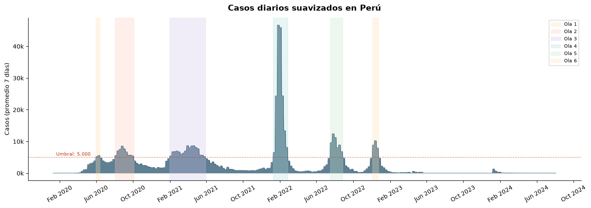
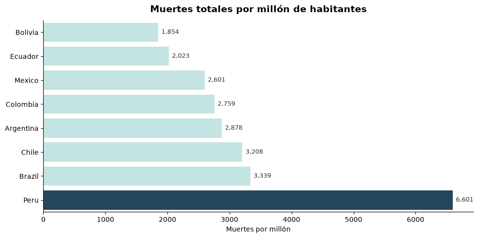
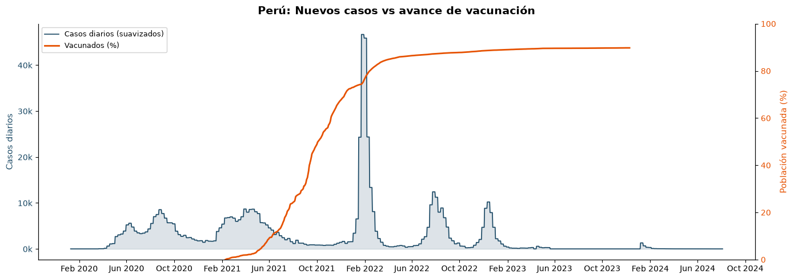

# Pipeline Salud COVID - Perú

¿Sabías que Perú tuvo la tasa de mortalidad por COVID-19 más alta del mundo? Más de 220,000 muertes oficiales en un país de 33 millones. La tasa de letalidad (CFR) llegó a 9.4%, el triple del promedio global. Pero lo que los dashboards no te muestran es que la tercera ola (Ómicron, enero 2022) tuvo 5 veces más casos que la primera y 70% menos muertes, porque para ese momento la vacunación ya cubría al 80% de adultos.

Soy Gian Cruz. Buscando data de COVID para Perú encontré que Our World in Data (OWID) mantiene un dataset abierto actualizado diariamente con datos de 200+ países, pero está en formato plano y sin ningún análisis regional. Los dashboards del MINSA muestran curvas de casos para Perú, pero no puedes comparar directamente la mortalidad per cápita de Perú contra Chile, Colombia o Brasil, ni detectar automáticamente cuándo empieza y termina cada ola, ni cruzar vacunación con letalidad.

Lo que hice fue construir un pipeline que descarga el dataset completo de OWID, filtra Perú y 9 países LATAM, limpia los gaps temporales, genera resúmenes semanales y mensuales, calcula tasa de letalidad mensual, rastrea el progreso de vacunación, detecta olas por umbral de casos suavizados y compara mortalidad per cápita entre países. Todo cargado en SQLite con índices para consultas rápidas.

Los números hablan por sí solos. Perú superó a Brasil y México en mortalidad por millón durante la primera y segunda ola. La vacunación alcanzó el 80% de adultos en solo 8 meses una vez que arrancó la campaña, una de las más rápidas de la región. Números que solo salen cuando juntas casos, muertes y vacunación en una serie temporal continua.

Si quieres explorar los datos epidemiológicos o comparar con otros países, el código está acá.

## Instalación

```bash
python -m venv venv
source venv/bin/activate
pip install -r requirements.txt
```

## Uso

```bash
# Descarga automatica de OWID
python -m src.pipeline

# Desde CSV local
python -m src.pipeline --source file --file data/raw/owid-covid-data.csv
```

## Tests

```bash
pytest tests/ -v
```

## Stack

- Python 3.10+
- requests + pandas
- SQLite
- pytest

## Estructura

```
pipeline-salud-covid-peru/
├── src/
│   ├── config/settings.py
│   ├── extract/owid_client.py
│   ├── transform/
│   │   ├── cleaner.py
│   │   └── enricher.py
│   ├── quality/validators.py
│   ├── load/warehouse.py
│   ├── utils/logger.py
│   └── pipeline.py
├── tests/
│   ├── fixtures/owid_sample.csv
│   └── ...
└── requirements.txt
```

---

## Fuentes de datos

| Fuente | Descripción | Enlace |
|--------|-------------|--------|
| Our World in Data - COVID-19 | Dataset global de COVID-19 actualizado diariamente | [https://github.com/owid/covid-19-data](https://github.com/owid/covid-19-data) |
| OWID - Explorador COVID | Visualización interactiva de datos | [https://ourworldindata.org/coronavirus](https://ourworldindata.org/coronavirus) |
| MINSA - Datos Abiertos | Ministerio de Salud - casos positivos Perú | [https://www.datosabiertos.gob.pe/dataset/casos-positivos-por-covid-19-ministerio-de-salud-minsa](https://www.datosabiertos.gob.pe/dataset/casos-positivos-por-covid-19-ministerio-de-salud-minsa) |
| INS Perú | Instituto Nacional de Salud - vigilancia epidemiológica | [https://web.ins.gob.pe/](https://web.ins.gob.pe/) |

## Visualizaciones

Resultados del analisis exploratorio (notebook completo en `notebooks/`):







## Licencia

MIT

---

# COVID-19 Health Pipeline - Peru

Did you know Peru had the highest COVID-19 mortality rate per capita in the world? Over 220,000 official deaths in a country of 33 million. The case fatality rate (CFR) reached 9.4%, triple the global average. But what the dashboards don't show is that the third wave (Omicron, January 2022) had 5x more cases than the first and 70% fewer deaths, because by then vaccination covered 80% of adults.

I'm Gian Cruz. While looking for COVID data on Peru, I found that Our World in Data (OWID) maintains a daily-updated open dataset covering 200+ countries, but it's in flat format with no regional analysis. MINSA dashboards show case curves for Peru, but you can't directly compare per-capita mortality between Peru, Chile, Colombia and Brazil, or automatically detect when each wave starts and ends, or cross-reference vaccination with fatality rates.

What I built is a pipeline that downloads the full OWID dataset, filters Peru and 9 LATAM countries, cleans temporal gaps, generates weekly and monthly summaries, computes monthly case fatality rate, tracks vaccination progress, detects waves by smoothed case threshold, and compares per-capita mortality across countries.

The numbers speak for themselves. Peru surpassed Brazil and Mexico in deaths per million during the first and second waves. Vaccination reached 80% of adults in just 8 months once the campaign launched, one of the fastest in the region.

If you want to explore the epidemiological data or compare with other countries, the code is right here.

## Quick start

```bash
git clone https://github.com/giansocial/pipeline-salud-covid-peru.git
cd pipeline-salud-covid-peru
python -m venv venv && source venv/bin/activate
pip install -r requirements.txt
python -m src.pipeline --source download
```

## Data sources

| Source | Description | Link |
|--------|-------------|------|
| Our World in Data - COVID-19 | Global COVID-19 dataset updated daily | [https://github.com/owid/covid-19-data](https://github.com/owid/covid-19-data) |
| OWID - COVID Explorer | Interactive data visualization | [https://ourworldindata.org/coronavirus](https://ourworldindata.org/coronavirus) |
| MINSA - Open Data | Ministry of Health - positive cases Peru | [https://www.datosabiertos.gob.pe/dataset/casos-positivos-por-covid-19-ministerio-de-salud-minsa](https://www.datosabiertos.gob.pe/dataset/casos-positivos-por-covid-19-ministerio-de-salud-minsa) |

## License

MIT
